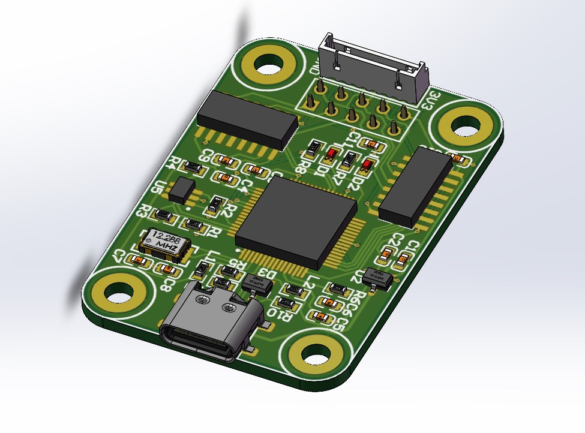
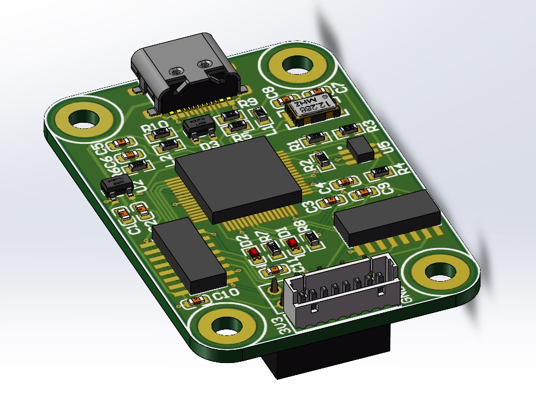
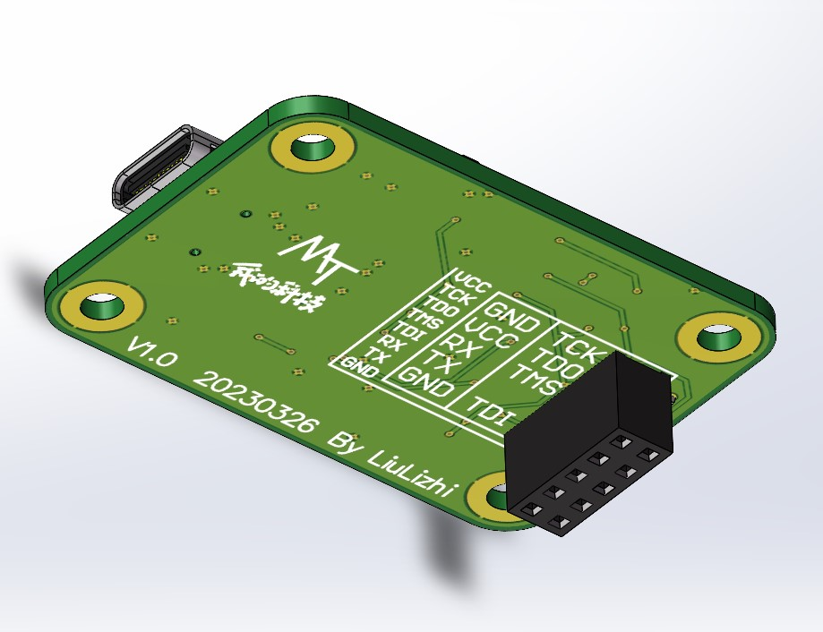

# **MyJTAG**

- ## 简介

本项目使用Digilent JTAG方案，使用FT2232HL芯片构建定制化的JTAG模块，提供一路JTAG调试接口与一路串口。

- ## 固件烧写

本人使用VMware16 + Ubuntu16.04.4进行固件烧写。

首先在Ubuntu下安装ftdi_eeprom工具：

```bash
sudo apt-get install ftdi_eeprom
```

然后将bin文件夹内的两个文件复制到虚拟机中，输入以下命令完成烧写：

```bash
sudo ftdi_eeprom --flash-eeprom flash_digilent_smt1.conf
```

注意：要确保设备连接至虚拟机而非主机，如烧写失败可尝试重新插拔并重试。





